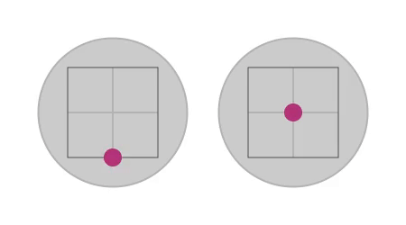

RC Visualiser
=============

Display a visual representation of the sticks of an RC transmitter on your
screen. Intended for demonstrating things with transmitter connected via USB or
receiver.



Building
--------

Ensure you have [installed the Rust compiler][install-rust] and the sdl2
development libraries (`sdl2` package on Arch Linux), then:

```
cargo build --release --locked
```

Running
-------

After building the binary will be at `target/release/rc-visualiser`.

When run it will look for a `config.toml` file in the current directory. There
is a sample included in this repo, adjust to your liking.

Licence
-------

This project is dual licenced under either of:

- Apache License, Version 2.0 ([LICENSE-APACHE](https://github.com/wezm/rc-visualiser/blob/master/LICENSE-APACHE))
- MIT license ([LICENSE-MIT](https://github.com/wezm/rc-visualiser/blob/master/LICENSE-MIT))

at your option.

[install-rust]: https://www.rust-lang.org/learn/get-started

